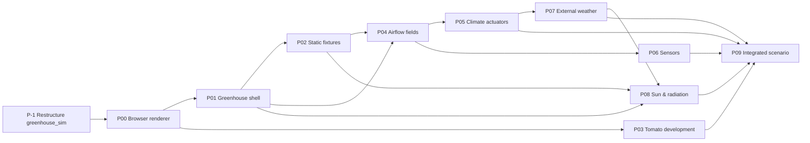

# Simulator roadmap

`greenhouse_sim` is growing from a small daily simulator into a modular,
visual and physical greenhouse simulation environment. This folder is the
public record of that work: one document per project, kept up to date by the
pull requests that implement it. How the folder is maintained is described in
[docs/engineering.md](../engineering.md#roadmap-and-decision-records).

## What the simulator is for

A permanent environment for synthetic data generation, counterfactual
testing, policy evaluation, digital-twin research, robot development and
reinforcement-learning or planning experiments. It should be useful on its
own, runnable without any hosted service, and expose contracts stable enough
for plant models, environment models, sensors, robots, actions and policies
to be developed against it.

Over time it should support:

- individual plants with persistent identity and organ-level structure
  (stems, internodes, leaves, trusses, flowers, fruits);
- stochastic longitudinal development that responds to temperature,
  radiation, CO₂, humidity, water and management actions;
- explicit 3D geometry for plants, greenhouse structures and equipment;
- spatially varying climate behind interchangeable models of different
  fidelity;
- virtual cameras and environmental sensors with realistic imperfections;
- robots, rails and actuators, and crop work such as pruning, harvesting and
  lowering;
- perfect ground truth for evaluation, while policies see only realistic
  observations;
- deterministic replay from fixed seeds, and batch simulation at scale.

The guiding hypothesis: **own the simulation world, its contracts, time,
state and orchestration; reuse or adapt specialist engines for biology,
rendering, physics, CFD and numerical acceleration.**

## Principles

- **Modular fidelity.** Every expensive or scientifically difficult
  subsystem sits behind an interface that admits several implementations,
  from a simple baseline to a high-fidelity backend. A simple backend that is
  explicit about its limits beats an impressive but inseparable monolith.
- **The canonical world state is ours.** External engines update or derive
  parts of it through adapters. They never become the global source of
  truth.
- **Ground truth is not observation.** The world state is what is true; an
  observation is what a particular sensor would report, with noise, occlusion,
  latency and gaps. Policies run on observations; evaluation compares them
  with the truth.
- **Data-oriented hot paths.** The domain API can expose plants and fruits as
  objects, but large populations are stored so that biological kernels can be
  vectorized and later moved to faster backends without a redesign.
- **Multi-rate simulation.** Robot physics, cameras, climate, physiology,
  development and crop work each advance at their natural timescale, and the
  orchestrator owns simulated time.
- **Deterministic stochasticity.** Every run is reproducible from a seed
  hierarchy (simulation, scenario, plant, organ or process), independent of
  batching or worker count where practical.
- **Sensor equivalence over visual beauty.** Rendering is judged by how well
  its output transfers to real sensor data, not by how it looks.

## Not goals for the first versions

Cell-level plant models, continuous full Navier-Stokes for a whole
greenhouse, botanically accurate deformable mechanics, cinematic realism for
its own sake, every crop or greenhouse technology, differentiable backends
throughout, or a hectare at full fidelity in real time.

## Current technical choices

- Stay in this repository. `greenhouse_sim` is restructured and expanded;
  `greenhouse_protocol` and `greenhouse_adapters` keep their roles.
  Downstream applications may depend on these packages, never the reverse.
- Python for simulation and orchestration
  ([0003](../decisions/0003-require-python-3-14.md): Python 3.14).
- A browser viewer in React and TypeScript with Three.js through React Three
  Fiber, on WebGL first, with a renderer boundary that leaves room for WebGPU.
  The viewer and a thin local API are adapters around the headless core.
- Our own stochastic, organ-level tomato model. Existing functional-structural
  plant modelling work (GroIMP and the Virtual Tomato Crop, OpenAlea and
  PlantGL, CPlantBox) informs it as a scientific reference, not as a runtime
  foundation.
- One canonical environment-field interface with lightweight backends, and
  OpenFOAM as an optional external high-fidelity backend.
- Visual QA through deterministic scenario and seed URLs, Playwright
  screenshot regression and numerical probes.

Deliberately not decided yet: the acceleration path (Rust or JAX), the final
CFD engine and renderer, a differentiability strategy, and distributed or
cloud execution. Those follow evidence from the local simulator.

## Projects

Every project ends with a named browser QA scenario and an explicit
checklist. Every commit keeps the simulator runnable and, where practical,
adds a visible or measurable result.

| Project | Goal | Status |
| --- | --- | --- |
| [P-1](p-1-restructure-greenhouse-sim.md) | Restructure `greenhouse_sim` into a modular foundation, without changing behavior | Done |
| P00 | Browser renderer and visual QA foundation | Planned |
| P01 | Greenhouse envelope and world geometry | Planned |
| P02 | Static greenhouse fixtures and layout | Planned |
| P03 | Stochastic tomato development and procedural plant geometry | Planned |
| P04 | Environmental fields and airflow foundation | Planned |
| P05 | Climate actuators: fans, heaters, dehumidification and vents | Planned |
| P06 | Virtual sensors and the observation layer | Planned |
| P07 | External weather and greenhouse boundary coupling | Planned |
| P08 | Sun position, glazing and radiation propagation | Planned |
| P09 | Integrated greenhouse scenario, replay and release QA | Planned |

A project's document is added when its first pull request lands.

P03 is a biology track that can progress alongside P01 to P05 once the
renderer foundation exists.
